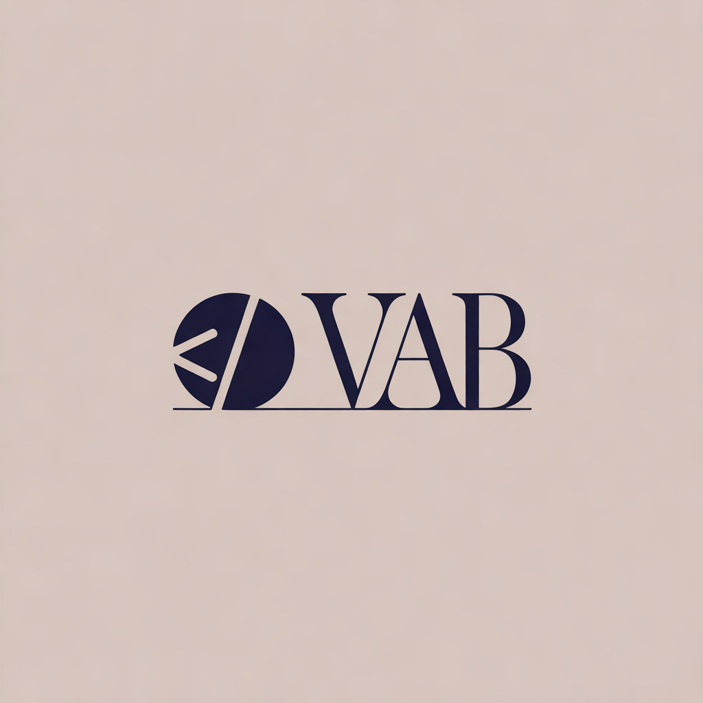

# VAB-CODE ⚡ Online Code Editor & In-Browser Compiler

<p align="center">
  
</p>

<p align="center">
  <strong>A high-performance, zero-setup, in-browser online code editor and compiler built for developers and engineering students.</strong>
</p>

<p align="center">
  <a href="https://vab-code.in/"></a>
  <a href="https://vab-code.web.app/"></a>
  
</p>

---

## 🚀 Overview

**VAB-CODE** is a browser-based IDE and code runner that eliminates the friction of local toolchain installations, heavy desktop editors, and server latency. Write code in **Python, C, C++, Java, or web technologies (HTML, CSS, JS)** and execute it instantly with full standard input (stdin) support.

### ✨ Key Features

- **Multi-Language Support**:
  - 🐍 **Python 3** (Pyodide WebAssembly runtime)
  - ⚡ **C & C++** (WASM-based compilation and execution)
  - ☕ **Java** (In-browser JVM execution engine)
  - 🌐 **Web Preview** (Live interactive sandboxed HTML5/CSS3/JavaScript rendering)
- **⚡ Zero Backend Latency**: Code execution is sandboxed and processed client-side for rapid feedback without queue times.
- **🔄 Universal Code Translation**: Convert algorithms and code logic seamlessly between languages (e.g., Python to C++, Java to Python).
- **⌨️ Custom Input (stdin)**: Fully supports interactive inputs like `input()`, `scanf`, `cin`, and `Scanner`.
- **🧩 Curated DSA Coding Problems**: Built-in challenges with problem descriptions, examples, constraints, and one-click code loading.
- **🎨 Modern Dark Workspace**: Ergonomic code editor with customizable themes, split views, resizable consoles, and syntax highlighting.
- **🔒 100% Client-Side Privacy**: Code snippets and settings are saved exclusively in your browser's private local storage. No server logging.

---

## 🛠️ Tech Stack

- **Frontend Core**: Vanilla HTML5, Modern CSS3 (Grid, Flexbox, Custom Design Tokens), Vanilla JavaScript (ESNext)
- **Build Tooling**: Vite
- **Icons**: Lucide Icons
- **Deployment & Hosting**: Firebase Hosting, Cloudflare DNS

---

## 💻 Getting Started Locally

To run VAB-CODE on your local machine:

1. **Clone the repository:**
   ```bash
   git clone https://github.com/varun1271/vab-code.git
   cd vab-code
   ```

2. **Install dependencies:**
   ```bash
   npm install
   ```

3. **Start the local development server:**
   ```bash
   npm run dev
   ```

4. **Build for production:**
   ```bash
   npm run build
   ```

---

## 🌐 Live Platform

Access the live compiler anytime at:
- **Primary Domain**: [https://vab-code.in/](https://vab-code.in/)
- **Mirror**: [https://vab-code.web.app/](https://vab-code.web.app/)

---

## 👤 Author & Maintainer

- **Creator**: Varun Reddy (Yeduguri Varun Kumar Reddy)
- **GitHub**: [@varun1271](https://github.com/varun1271)
- **LinkedIn**: [Varun Reddy](https://www.linkedin.com/in/yeduguri-varun-kumar-reddy-45a808384)
- **Email**: [vabcode.official@gmail.com](mailto:vabcode.official@gmail.com)

---

## 📄 License & Copyright

Copyright © 2026 **Varun Reddy (Yeduguri Varun Kumar Reddy)**. All Rights Reserved.

This source code and design are protected by copyright law. Viewing the code for educational and portfolio demonstration purposes is permitted; copying, modifying, reproducing, re-hosting, or redistributing this software without explicit prior written authorization is strictly prohibited. For inquiries, contact [vabcode.official@gmail.com](mailto:vabcode.official@gmail.com).

